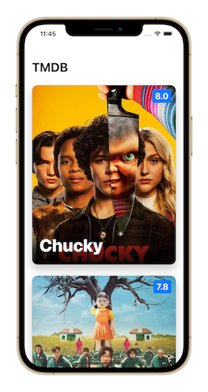

# 🎬 TMDB

This project was build using Clean Architecture and [TMDB](https://developers.themoviedb.org/3) api.

## ⭐️ Features
- ✅ Display list of popular series.
- ✅ Display movies details and similar movies.

## 📋 TODO
- Add search functionality.
- Add UI and Unit tests.

### ⚙️ Compatibility
This project is written in Swift 5.0 and requires Xcode 12.5+ to build and run.

### 📲 Getting Started
Navigate to the directory and run `pod install`. Then open TMDB.xcworkspace to run the project.
